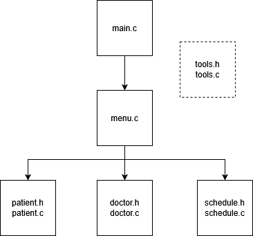

# Project Report

| Name       | Student # |
|------------|-----------|
| Owen Wou   | A00989377 |
| Alison Kim | A01434656 |

*A comprehensive report, 2-5 pages long, covering the following headings.*

## 1. Project Objectives and Scope

*Outline the goals and scope of the project.*

The objective of this project is to design and implement a Hospital Management
System in the C programming language. The system will allow for management of patient
records, doctor records, and hospital shift scheduling.

Phase 1 implements foundational programming concepts that we have learned, in a
modular fashion to implement the basic functionality of the system. This includes
handling of user input as well as validation checks for data integrity and type
compliance.

## 2. Design and Implementation Details

*Describe the design approach and implementation steps*.

Our design approach relies heavily on every section being as modular as possible
and maintaining strong coding standards. Each section is separated into its 
own files and grouped together with related functions such as menu, patient, 
doctor, schedule and tools.

### 2. Features Implemented




#### 2.1 Patient Records Management

Each patient record was implemented as a struct, with the information and
limitations from Table 2.1. The implementation for the validation of these inputs are discussed further in section
[2.5 Input Validation](#25-input-validation).
These structs are then held in a patient array with a max size of 50, as per the
requirements of the project.

Table 2.1 Patient Data Structure

| Description | Datatype | Not Null | Not Blank | Unique | Min Value | Max Value |
|-------------|:--------:|:--------:|:---------:|:------:|:---------:|:---------:|
| Patient ID  |   int    |   N/A    |    N/A    |   Y    |     1     |    50     |
| Name        |  String  |    Y     |     Y     |   N    |    N/A    |    N/A    |
| Age         |   int    |   N/A    |    N/A    |   N    |     0     |    100    |
| Diagnosis   |  String  |    Y     |     Y     |   N    |    N/A    |    N/A    |
| Room Number |   int    |   N/A    |    N/A    |   Y    |     1     |    200    |

#### 2.2 Basic Operations on Patient Records

#### 2.2.1 Add a new patient record: void addNewPatient(void)

1. Checks if the hospital is full
2. Gets the user to input a unique ID by comparing against existing patient IDs
3. Gets the user to input the patients name (accepts only alphabetic letters)
4. Gets the user to input the patient's age (within a specified range)
5. Gets the user to input the patient's diagnosis (no input restrictions)
6. Gets the user to input the room number (not required to be unique, but 
   within a specified range)
7. Creates the patient record
8. Increments total patient count
9. Prints to screen that the patient has been successfully added

#### 2.2.2 Search for patient record: void searchForPatientRecord(void)

1. Prints to screen the available options for the user to select
2. Gets and validates the number input from the user
3. Goes to a submenu to select whether to search by patient ID or name
4. Both do a linear search through the array and return the result; however if 
   searching by name, the program will return a list of patients if there are multiple matching records
5. The user will repeat 1-4 until they select to return to the main menu

#### 2.2.3 Print patient record: void printPatientRecord(int index)

This function prints the patient records to the screen in the following format:

``````
+------+-------------+---------+-----------------+---------------+
| ID   | Name        | Age     | Diagnosis       | Room Number   |
+------+-------------+---------+-----------------+---------------+
| 1    | Owen        | 25      | Concussion      | 2             |
+------+-------------+---------+-----------------+---------------+
``````

#### 2.2.4 View all patient records: void viewAllPatientRecords(void)

View all patient records function calls printPatientRecord once for each 
patient.

```
+------+-------------+---------+-----------------+---------------+
| ID   | Name        | Age     | Diagnosis       | Room Number   |
+------+-------------+---------+-----------------+---------------+
| 1    | Owen        | 25      | Concussion      | 2             |
| 2    | Alison      | 25      | Concussion      | 90            |
+------+-------------+---------+-----------------+---------------+
```
printPatientRecord() is called once for each element in the array.

#### 2.2.5 Discharge Patient: void dischargePatient(void)
1. Remove patient record from patient array, prompting for ID of patient to discharge
2. If there is no patient with the corresponding ID, prints that patient record was not found
3. Resulting gap in the array is addressed by shifting each element one place to the left

#### 2.3 Doctor Management

| Description | Datatype | Not Null | Not Blank | Unique | Min Value | Max Value |
|-------------|:--------:|:--------:|:---------:|:------:|:---------:|:---------:|
| Doctor ID   |   int    |   N/A    |    N/A    |   Y    |     1     |    10     |
| First Name  |  String  |    Y     |     Y     |   N    |    N/A    |    N/A    |
| Last Name   |  String  |    Y     |     Y     |   N    |    N/A    |    N/A    |
| Specialty   |  String  |    N     |     N     |   N    |    N/A    |    N/A    |

#### 2.3.1 Add a new doctor record: void addNewDoctorRecord(void)
1. Checks if doctors at hospital are already at full capacity
2. Gets the user to input a unique ID by comparing against doctor IDs
3. Gets the user to input the doctor's first and name (accepts only alphabetic letters)
4. Gets the user to input the doctor's specialty (no input restrictions)
5. Creates the doctor record
6. Increments total doctor count
7. Prints to screen that the doctor has been successfully added

#### 2.3.2 Fire doctor: void fireDoctor(void)
Parallels implementation of
[2.2.5 Discharge Patient](#225-discharge-patient-void-dischargepatientvoid).

#### 2.3.3 View all doctor records: void viewAllDoctorRecords(void)
Parallels implementation of
[2.2.4 View All Patient Records](#224-view-all-patient-records-void-viewallpatientrecordsvoid).

#### 2.4 Shift Management
We implemented a two-dimensional array with the day of the week and the time of day
as a composite primary key. Each cell value contains a foreign key referencing the doctor ID of
the doctor on shift, allowing us to access the doctor struct in our display functions.

#### 2.5 Input Validation
We implemented strict checks for valid inputs across our program by creating modular
components which:
1. Scan for input from the buffer
2. Check that input was of the correct type (by ensuring it was successfully read and assigned, using the return value of scanf)
3. Check that input was within the specified range / domain of values, taken in as a parameter
4. In the case of names, check that input was not null or blank or non-alphabetic, using functions from ctype.h

Each step re-prompts the user when invalid input is detected, and is contained inside a do-while loop.

For further implementation details, documentation for `promptForInput()`, `getInput()`, and `validateData()`.

#### 2.6 Menu Driven Interface

Our system has four main menus that users will navigate through.

```
Hospital Management System
0. Exit
1. Add Patient Record
2. View ALl Patients
3. Search Patient
4. Discharge Patient
5. Manage Doctors
6. Manage Schedule
Enter your selection:
```

3. Search Patient
```
0. Return to Menu
1. Search by Patient ID
2. Search by Patient Name
Enter your selection:
```

5. Manage Doctors
```
0. Return to Main Menu
1. Add New Doctor
2. Fire Doctor
3. View All Doctor Records
Enter your selection:
```

6. Manage Schedule
```
0. Return to Main Menu
1. Assign Doctor to Shift
2. Clear Shift
3. View Week Schedule
Enter your selection:
```

## 3. Challenges and Solutions

*Discuss any challenges faced during the project and how they were overcome.*

Some of the key challenges we faced are as follows:

### 3.1 Learning where to decompose functions and implement reuse
We started out with significant repetition within our codebase, as we struggled with
modularizing each functionality. This became especially obvious when prompting for user input for different fields of the same data type -
for example, when prompting for patient age and room number.

Given that the only differences between
these two prompts are the lower and upper bounds of the value and the printed prompt / error messages,
we created a set of utility functions to wrap this functionality. This spans from low level
functionality such as clearing the input buffer, to higher level functionality such as
the do-while loop to prompt for valid input. When prompting for unique input, such as in the case of ensuring
each patient / doctor ID is unique before entry into the database, we also made use of function
pointers to reference the patient and doctor's respective idExists function to mitigate redundancy.

### 3.2 Separating out Struct in patient.h and patient.c
Initially, we ran into problems when trying to separate our file system into header
and source code files. It took us a while to troubleshoot and figure out that the struct
we defined for patient needed to be present in the header file, as this allows the compiler to
understand how the struct works prior to encountering it in the function prototype.
Doing our best to understand *why* things were not working and trying different solutions to make it
work was key to our development process.

### 3.3 Issues assigning Strings to schedule cells after they have been initially assigned

When initially prototyping the schedule module, we were inserting the doctors' 
names to indicate that a doctor was assigned a schedule. This creates issues when
reassigning the shifts in the char array, because once initialized, they become an immutable
String literal.

To solve this, we make each doctor a struct with a unique ID which acts as a 
primary key. This then allows us to make the schedule array an array of ints
(simulating a foreign key to doctor ID) instead of char* and lets us change
the shift assignments much more easily. The tradeoff of this is that printing
the schedule requires more overhead before the doctor's name can be displayed;
however, we deemed this to be a small tradeoff in comparison.

## 4. Testing Procedures and Results

*Explain the testing methods used and present the results.*

Our testing consisted primarily of manual testing regarding invalid input of various 
types in different contexts - essentially, we checked how our program responded when
given input of the wrong type. All tests of this type did not uncover any 
bugs as our input validation is relatively strict.

Our testing did however uncover bugs when it came to printing the tables of 
patient and doctor information as can be seen below. In the first image the 
input by the user is the full english alphabet twice; this is longer than 
the max characters allowed in a doctor's first and last name. This 
overflow of characters is automatically consumed by the last name scanner as 
well and the specialty's scanner. This caused not only the incorrect last 
name and specialty to be saved, but also formatting errors in the table 
printed to the screen.

To resolve this, we check if the inputted string contains a `\n`newline 
character. If the newline character is not present, then the input is 
assumed to have been longer than the maximum String length, and the input
buffer is cleared until a newline character is encountered. This ensures that
subsequent scanners are not accidentally being handed the overflow.


## 5. Conclusion

*Summarize the project outcomes.*

This project implements structures, input validation, menu-driven interfaces 
and pointers to build a functional hospital management system. 
